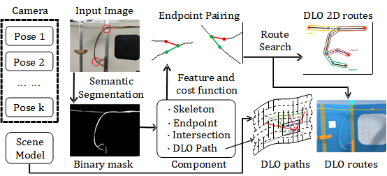
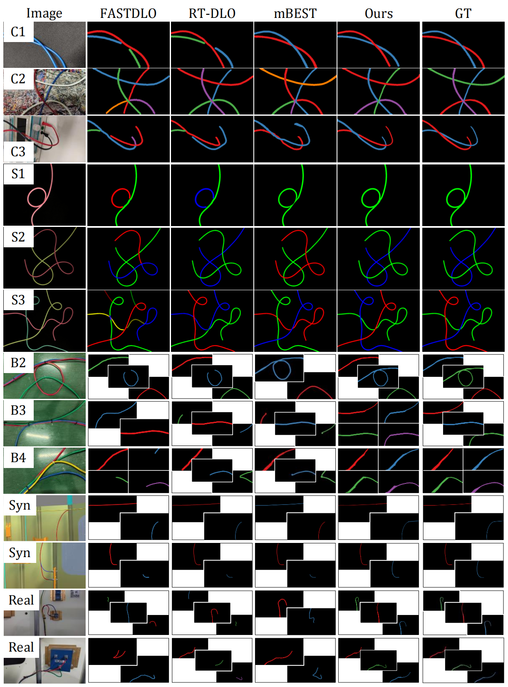

## CVF-DLO: Cross Visual Fields Branched Deformable Linear Objects Route Estimation

---
<p align="center">

<br>
<em> CVF-DLO Pipeline Overview </em>
</p>

We present *CVF-DLO*, an approach for route estimation across the visual fields of branched DLOs (BDLOs), such as wire harnesses, based on images from different perspectives, using a pose-aware camera.

We provide a two-stage algorithm. The first part is the algorithm for BDLOs instance segmentation in images. The second part is the algorithm for cross-visual-fields BDLOs route estimation by combining images from multiple perspectives.

---

### Instructions

All code has been developed and tested on Python 3.8. Please install the following dependencies.

```
numpy
numba
opencv-python
matplotlib
scikit-image
scikit-learn
Cython
```

Then, compile functions using the shell script as shown below.
```bash
./install.sh
```

We provide 4 DLO datasets in `DATASETS`. `EWD` and `SBHC` are public unbranched DLO datasets from *FASTDLO* and *mBEST*. `BWH` is a planar BDLO dataset we build.
In addition, we provide `LABD-Syn` and `LABD-Real`. These two are a collection of virtual images and a collection of real images of the same scene. We have also provided the scene model and the sampling points on the cables in `Scene Model`.
Finally, you can use `Cable_Line_Extraction.py` in `Unity Extraction` to sample and reconstruct the cable routes with different densities.

Below are some results comparing *FASTDLO*, *mBEST*, *RT-DLO*, and *CVF-DLO* on different datasets.

<p align="center">

<br>
<em> Fig. 2 CVF-DLO and SOTA comparison </em>
</p>

---

### DLO Instance Segmentation

```bash
python3 run_test_EWD.py
python3 run_test_SBHC.py
python3 run_test_BWH.py
```

Running the above code can verify CVF-DLO on the three datasets of EWD, SBHC and BWH respectively, and the mask or route mask can be directly output.

```bash
python3 run_with_mask.py
```

Running this code, CVF-DLO can be run on LABD-Syn or LABD-Real to output the set of skeletal pixels of the DLO routes.

```bash
python3 DICE_BWH.py
python3 PQ_BWH.py
```

The segmentation results of DLO instances can be evaluated through this code (`Evaluation`).

```bash
python3 B_Spline_Approximation.py
```

Through this code (in `CVF\process`), B-spline curve fitting can be performed on the planar cable routes.

---

### DLO Path Projection

We utilized the scene reconstruction function and projection line calculation function of Unity to achieve the projection of DLO path into the space. The relevant C# code in `Scene Model`.

Through this step, we can obtain several DLO path3Ds.

---

### DLO Route Estimation

First of all, we need to merge DLO path3Ds (`CVF\process_3D`).

```bash
python3 Path3D_merge.py
```

This program can merge the cables that are disconnected due to field of view limitations and perform route search throughout the scene.

Ultimately, all possible DLO routes will be output.